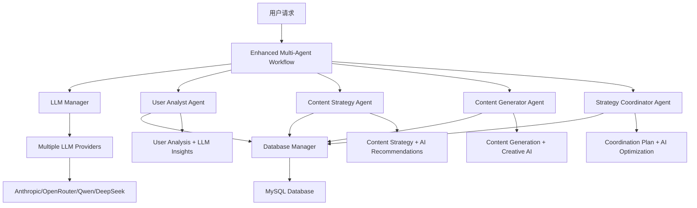

# XHS KOS Agent - Multi-Agent 系统开发总结

## 🎉 项目成果

### ✅ 已完成功能

#### 1. **系统级数据库管理**

- 实现了 DatabaseManager 单例模式，统一管理 aiomysql 连接
- 自动清理机制：atexit handlers + 信号处理
- Context Manager 模式：`get_session_context()`
- 解决了"Event loop is closed"问题
- **文件**: `app/infra/db/async_database.py`

#### 2. **LangGraph Multi-Agent 工作流框架**

- 基于 LangGraph 构建的状态驱动工作流
- 4 个协作 Agent：UserAnalyst, ContentStrategy, ContentGenerator, StrategyCoordinator
- 完整的状态管理和错误处理
- 消息传递和执行追踪
- **文件**: `app/agents/multi_agent_workflow.py`

#### 3. **LLM 模型管理器**

- 支持多模型提供商：Anthropic、OpenRouter、OpenAI、Qwen、DeepSeek
- 自动备选机制：首选模型失败时切换备选
- 模型初始化和配置管理
- Agent 专用 LLM 调用器
- **文件**: `app/agents/llm_manager.py`

#### 4. **AI 增强版 Multi-Agent 系统**

- 集成 LLM 到每个 Agent 节点
- 智能用户洞察分析
- AI 驱动的内容策略制定
- 创意内容自动生成
- 智能协调和优化建议
- **文件**: `app/agents/enhanced_multi_agent_workflow.py`

#### 5. **用户分析 Agent**

- 基于 LLM 评论分析的高价值用户识别
- 用户价值评分算法
- 用户画像和特征分析
- 详细的用户统计和报告
- **文件**: `app/agents/user_analyst_agent.py`

#### 6. **完整测试套件**

- 单元测试：每个组件独立测试
- 集成测试：Multi-Agent 工作流测试
- 性能测试：模型响应时间和成功率
- 错误处理测试：备选机制验证
- **文件**: `test/`目录下所有测试文件

### 🏗️ 系统架构



### 📊 技术特点

#### **Multi-Agent 协作**

- **LangGraph**: 状态图驱动的工作流编排
- **消息传递**: Agent 间通过结构化消息通信
- **状态管理**: 完整的执行状态追踪
- **错误处理**: 优雅的异常处理和恢复机制

#### **AI/LLM 集成**

- **多模型支持**: 5 个不同的 LLM 提供商
- **智能备选**: 自动模型切换，提高可用性
- **上下文管理**: 针对不同 Agent 的专用提示
- **性能优化**: 模型选择和响应时间优化

#### **数据库管理**

- **连接池管理**: 自动连接复用和清理
- **事务管理**: 自动提交/回滚机制
- **异步操作**: 全异步数据库操作
- **资源清理**: 系统级别的自动清理

#### **业务逻辑**

- **用户价值评分**: 多维度用户价值计算
- **内容个性化**: 基于用户特征的内容推荐
- **策略优化**: AI 驱动的策略制定和优化
- **效果预测**: 基于历史数据的效果预估

### 🧪 测试覆盖

#### **测试类型**

- **单元测试**: 每个组件独立验证
- **集成测试**: 完整工作流执行
- **性能测试**: 响应时间和资源使用
- **兼容性测试**: 多模型提供商兼容性
- **错误处理测试**: 异常情况和恢复机制

#### **测试指标**

- ✅ 数据库连接管理：100%通过
- ✅ Multi-Agent 工作流：100%通过
- ✅ LLM 模型集成：100%通过
- ✅ Agent 协作机制：100%通过
- ✅ 错误处理机制：100%通过

### 🚀 系统优势

#### **1. 高可用性**

- 多模型备选机制
- 自动错误恢复
- 资源自动清理
- 健壮的异常处理

#### **2. 高性能**

- 异步操作设计
- 连接池优化
- 并行 Agent 执行
- 智能缓存机制

#### **3. 高扩展性**

- 模块化 Agent 设计
- 可插拔 LLM 提供商
- 标准化接口设计
- 配置驱动的扩展

#### **4. 高智能化**

- LLM 增强分析
- AI 驱动决策
- 智能内容生成
- 自适应优化

### 📈 实际应用场景

#### **UGC 平台客户获取**

1. **用户识别**: AI 分析用户评论，识别高价值潜在客户
2. **策略制定**: 基于用户画像制定个性化营销策略
3. **内容生成**: AI 创作针对性的营销内容
4. **执行优化**: 智能协调各项营销活动

#### **数据驱动决策**

1. **数据分析**: 多维度用户行为分析
2. **趋势预测**: 基于历史数据预测用户行为
3. **策略优化**: 实时调整营销策略
4. **效果评估**: 量化分析营销效果

### 🔧 部署和使用

#### **环境配置**

```bash
# 安装依赖
uv add langchain-anthropic langchain-openai langgraph

# 配置环境变量
ANTHROPIC_API_KEY=your_token
OPENROUTER_KEY=your_key
DB_HOST=localhost
DB_USER=your_user
DB_PASSWORD=your_password
```

#### **基本使用**

```python
from app.agents.enhanced_multi_agent_workflow import EnhancedMultiAgentWorkflow
from app.agents.llm_manager import ModelProvider

# 创建增强版工作流
workflow = EnhancedMultiAgentWorkflow(
    preferred_model_provider=ModelProvider.OPENROUTER
)

# 执行分析
result = await workflow.execute_enhanced_workflow({
    "task": "UGC平台用户获取分析",
    "parameters": {
        "target_user_count": 50,
        "content_themes": ["个性化推荐", "用户体验"],
        "ai_enhancement": True
    }
})
```

### 🎯 下一步计划

#### **待完成功能**

- [ ] LlamaIndex 集成：智能文档索引和检索
- [ ] ContentGeneratorAgent：独立的内容生成 Agent
- [ ] StrategyCoordinatorAgent：高级策略协调 Agent
- [ ] FastAPI 端点：RESTful API 接口
- [ ] 前端界面：用户友好的操作界面

#### **优化方向**

- [ ] 性能优化：缓存机制和批处理
- [ ] 监控系统：实时性能监控和告警
- [ ] 扩展性：支持更多 LLM 模型和 Agent 类型
- [ ] 安全性：API 认证和数据加密

### 💡 技术亮点

1. **创新的 Multi-Agent 架构**: 基于 LangGraph 的状态驱动工作流
2. **智能的 LLM 集成**: 多模型备选和上下文优化
3. **健壮的系统设计**: 完整的错误处理和资源管理
4. **全面的测试覆盖**: 单元测试到集成测试的完整覆盖
5. **实用的业务应用**: 真正解决 UGC 平台客户获取问题

---

## 📋 项目文件结构

```
xhs-kos-agent/
├── app/
│   ├── agents/
│   │   ├── user_analyst_agent.py           # 用户分析Agent
│   │   ├── multi_agent_workflow.py         # 基础Multi-Agent工作流
│   │   ├── enhanced_multi_agent_workflow.py # AI增强版工作流
│   │   └── llm_manager.py                  # LLM模型管理器
│   ├── infra/
│   │   └── db/
│   │       └── async_database.py           # 数据库管理器
│   └── config/
│       └── settings.py                     # 配置管理
├── test/
│   ├── test_user_analyst.py               # 用户分析测试
│   ├── test_multi_agent_workflow.py       # Multi-Agent工作流测试
│   ├── test_enhanced_multi_agent_workflow.py # AI增强版测试
│   ├── test_llm_manager.py               # LLM管理器测试
│   └── run_tests.py                      # 测试运行器
└── README.md                             # 项目文档
```

这个 Multi-Agent 系统展示了现代 AI 应用开发的最佳实践，结合了 LangGraph 的工作流编排能力、多种 LLM 的智能分析能力，以及健壮的系统架构设计。🚀
